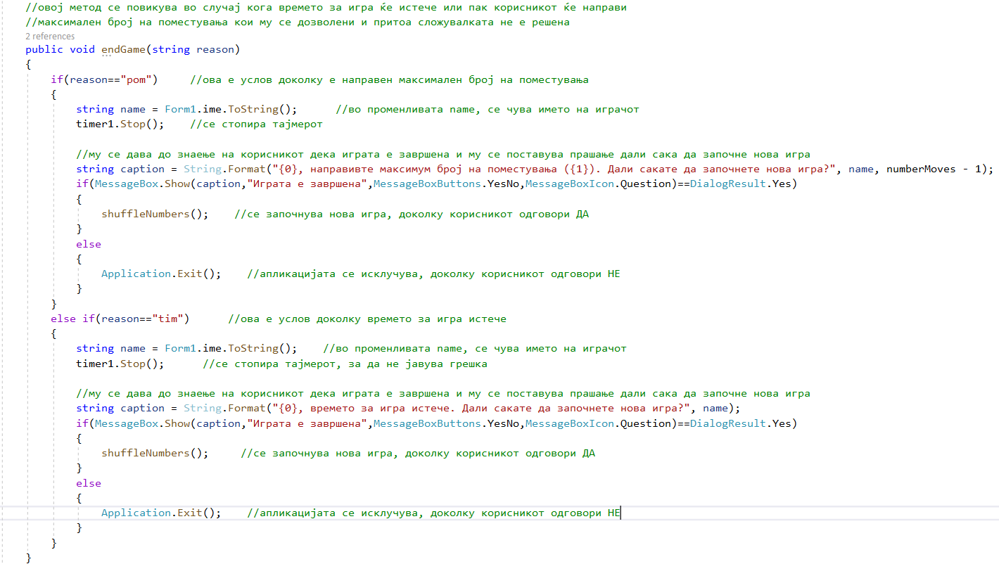
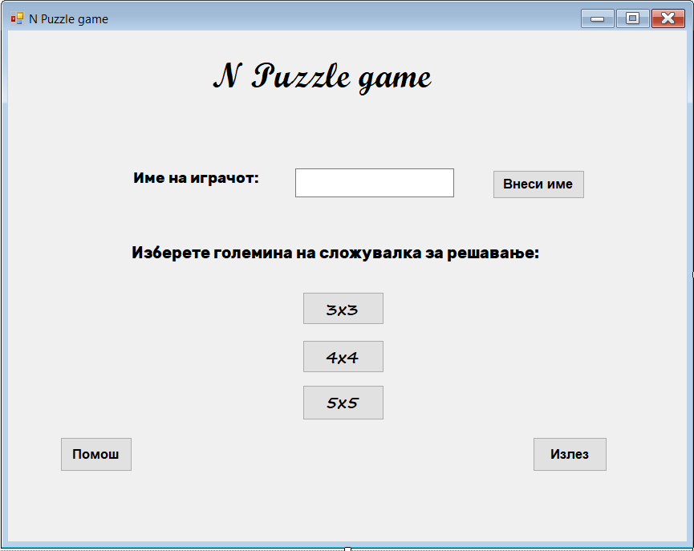
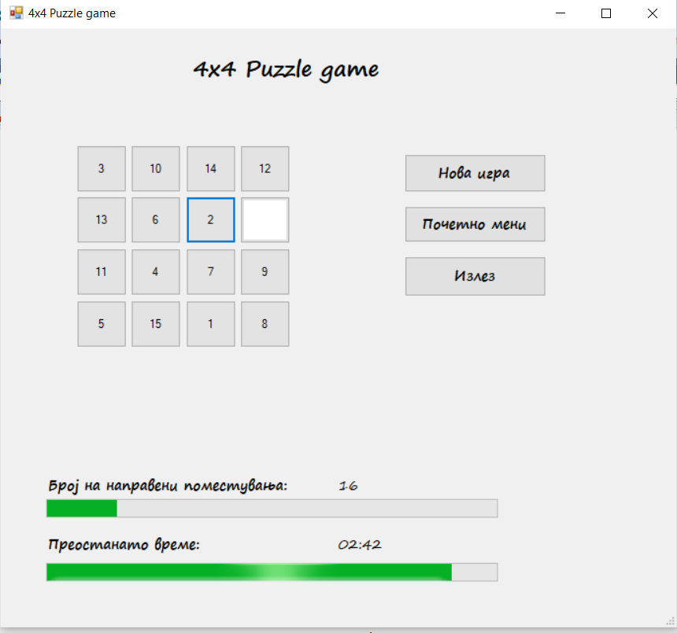
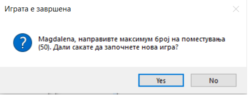
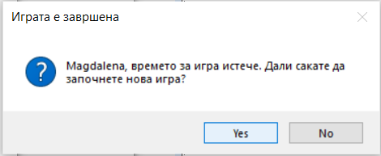

## NPuzzleGameVPproject

        Проектот е изработен од Магдалена Петрушевска

### Објаснување на проблемот
  Апликацијата N Puzzle game e имплементација на класичната игра N Puzzle, која е логичка загатка во која целта е дадените броеви кои се случајно измешани, да се подредат редоследно. 
  
  Во оваа апликација се дадени 3 различни големини за сложувалки за решавање. За секоја од нив е зададено различно маскимално време за кое треба да се реши сложувалката, како и да различен максимален број на поместувања кои можат да се направат во текот на решавањето.

### Опис на решението на проблемот  
  За да се направи имплементација на дадената игра, искористив 4 различни форми. Првата форма претставува некакво почетно мени, со кое се среќава корисникот кога ја стартува апликациајта. Во овој дел се имплементирани текстуално поле и копче за внесување на име на корисникот. Потоа останати три копчиња се искористени за да се овозможи избор на корисникот меѓу различни големини на сложувалки за решавање. Во оваа форма корисникот има и можност за избор да ја исклучи апликацијата како и копче за кратко упатство за играње.

Во кодот на оваа форма, односно нејзината класа, преку соодветни методи за настани при кликање на копчињата се имплментирани функциналностите на копчињата кои се опишани погоре. За секое од копчињата како услов за да може да се функционалноста е дадено првин да мора да е внесено име на играчот, односно не смее текстуалното поле да биде празно, пред да се продолжи со било која акција понатаму. Да за се осигураме дека во текстуалното поле, корисникот ќе внесе име, поставено е errorProvider, кој ќе јавува грешка доколку корисникот се обиде да го прескокне ова поле.

Останатите 3 форми се употребени за да се овозможи на корисникот да ја игра играта. Поставени се даден број на копчиња преко чие кликање се манипулира со празното поле. Дадени се и progress bar-овите преку кои се прикажува преостнато време за играње и бројот на поместувања кои се направени во текот на играта. Дополнително на корисникот му се дадени и опции во секое време да ја исклучи апликацијата, како и да започне нова игра од почеток или пак да се врати на почетното мени, односно првата форма.

Во секоја од формите, а со тоа и сооветните нивни класи, се дадени методи со помош на кое се регулираат правилата на игра. Со методот initialization() се прави иницијализација за сите променливи. Променливите со кои ќе работиме содветно означуваат изминато времето за игра, број на поместувања на полињата и други локални променливи кои се дефинирани во соодвените методи. 

Со методот sfuffleNumbers(), се овозможува секое од копчињата наменети за игра, да добие соодветен случаен број во ранг зависен од големината на сложувалката. При што едно копче секогаш останува без никаква бројка, тоа е копчето за манипулација. 

Со методот swapPlaces(), копчињата си ги менувааат местата кога е кликнато на копче означено со бројка, а се наоѓа околку копчето нема бројка.

Со методот checkOrder(), се проверува при секое поместување дали корисникот дошол до целата, односно дали сите броеви се редоследно поставени.

Со методот updateTimeRemainning(), се врши ажурирање на на progress bar-от за преостанатото време за игра.

На оваа слика може да се види објаснет методот endGame().

### Кратко упатство како се користи апликацијата

На почетокот се добива прозорец во кој имa поле за внес на име на играчот, кое е задолжително за внесување, пред да се започне со играње на играта. Откако ќе се внесе име, се избира големина на сложувалката која сакаме да ја решаваме. Големините соодветни се означени како NxМ, каде што N го означува бројот на редиците, а М го изначува бројот на колоните на секоја од сложувалките. Доколку се кликне не копчето Помош, тогаш се добива кратко упатство кое треба да му помогне не играчот корисник на аликацијата за тоа која е целта на ова игра и како да се дојде до нејзино решение. И соодветно имаме и копче за излез од апликацијата. 

Со избирање на било која големина на сложувалката, ќе се добие дадена сложувалка која треба да се реши. Целата на секоја сложувалка е да се подредат дадените броеви редоследно, манипулирајќи со едното празно поле. Манипулацијата со празното место се врши со кликање на соодветно копче кое е означено се некој број, ако се наоѓа околку празното копче. За решавање на различна големина на сложувалка соодветно се дадени и различни максимум број на поместувања кои играчот може да ги направи, како и максимално време за кое треба да се заврши секоја сложувалка, чиј што тек играчот може да го следи преку progress bar-овите кои се дадени. Доколку играчот го потроши зададеното време за игра и притоа не ја реши сложувалката, му се испишува соодветна порака. Истото важи и доколку го надмине максималниот број на поместувања на полињата. На крајот без разлика дали играчот успешно или неуспешно ја завршил сложувалката, даден му е избор за да започне нова игра. 

